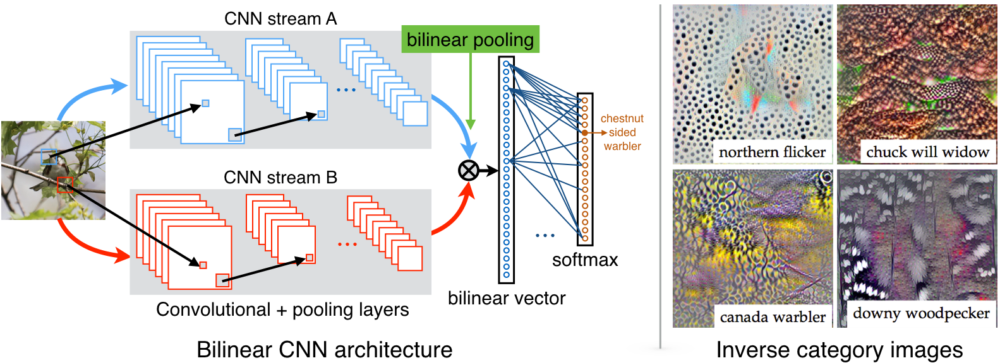
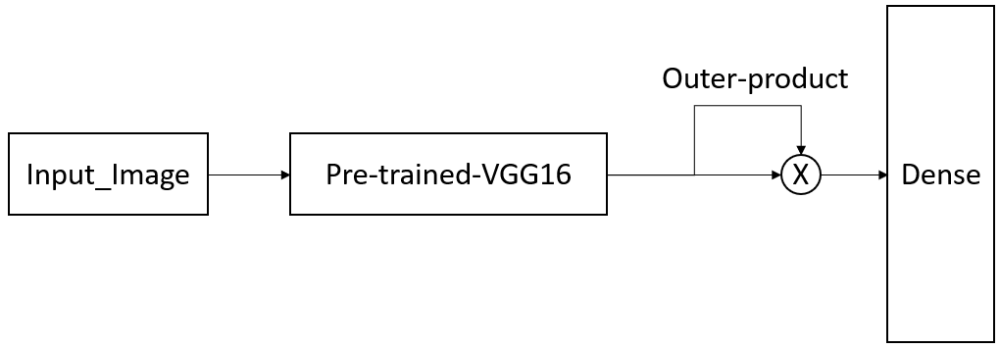

# Computer Vision Challenge - Stanford Cars

This repository is to build a model to classify car models using stanford-cars dataset.

## Requirements

- `tensorflow`
- `numpy`
- `opencv`
- `keras`
- `pandas`

## Steps

1.  Download and extract image data from [stanford cars](https://ai.stanford.edu/~jkrause/cars/car_dataset.html);
2.  Run `data processing.ipynb` to pre process the data;
3.  Run `car_model.ipynb` to train the model;
4.  Run `prediction.ipynb` to predict on the testing data.

## Solution and Results

The challenge is to classify the car models and make using stanford dataset. Unlike traditional image classification problem which is to categorize different objects, such as cats and dogs, trees and cars; this challenge is to classify car model and make within the class. In literature, the problem is called Fine-grained image classification probem. The problem is challenging, because the visual differences between the categories are small and can be easily overwhelmed by those minor difference caused by factors such as pose, viewpoint, or location of the object in the image.

The final model designed for this project is able to achieve **89.2%** validation accuracy and **87.8%** testing accuracy. The model architecture can be downloaded from [model](https://drive.google.com/open?id=1yZXlgnGRbhPNQ45rrDqwpYrC6Ei8bH_z), and weights can be downloaded from [weights](https://drive.google.com/open?id=1dGqBBalv6RT0hoRgwK9JNT7xz7KfBV4o).

### Pre-processing
The data was cropped using the bounding box to reduce background noise. 80/20 rule was applied for train-test split.

#### 1st Try

The first try is to simply tranfer learn the pre-trained models on image-net. VGG16, ResNet50 were experimented. The model results are:

| Architecture        |     Validation Accuracy     |       Testing Accuracy      |
|---------------------|:---------------------------:|:---------------------------:|
| VGG16               |             81%             |             79%             |
| ResNet50            |            84.5%            |             83%             |

The results show that traditional architectures were able to classify cars; however, is not as significant as expected. Inspired by a paper on [Bilinear CNN Models for Fine-grained Visual Recognition](http://vis-www.cs.umass.edu/bcnn/docs/bcnn_iccv15.pdf), a modified architecture was designed.

#### 2nd Try

##### BCNN
Bilinear CNN[1] is a simple yet powerful model for fine-grained image classification problem. The image is passed through two CNNs, A and B, and their outputs are multiplied using outer product at each location of the image and pooled to obtain the bilinear vector. Then it is passed through a classification layer to obtain predictions. 
By bilinear pooling, more feature combinations were created so as to classify minor difference between objects easily. 

##### BCNN (modified)
However, instead of passing to 2 single networks, the model used for this projetc was only passing to 1 VGG16 network to reduce processing time. The model architecture is as following:

The result shows that, bilinear pooling improved the model results significantly, where the validation accuracy increased to 89.2% and testing accuracy increased to 87.8%. The model architecture can be downloaded from [model](https://drive.google.com/open?id=1yZXlgnGRbhPNQ45rrDqwpYrC6Ei8bH_z), and weights can be downloaded from [weights](https://drive.google.com/open?id=1dGqBBalv6RT0hoRgwK9JNT7xz7KfBV4o).

| Architecture        |     Validation Accuracy     |       Testing Accuracy      |
|---------------------|:---------------------------:|:---------------------------:|
| VGG16-bilinear      |            89.2%            |           87.8%             |

## Further improvements
1. A bounding box is used to process the raw data. We could use car detection algorithm such as YOLO to localize the cars instead of using human lables.

2. There are total 196 classes in this dataset. However, each class can be divided into make, model, year. It is possible to first train on make, model, year and then pass into final layer to predict class.

## Reference

[1] [Bilinear CNN Models for Fine-grained Visual Recognition](http://vis-www.cs.umass.edu/bcnn/docs/bcnn_iccv15.pdf).

[2] [BCNN_keras](https://github.com/tkhs3/BCNN_keras).
